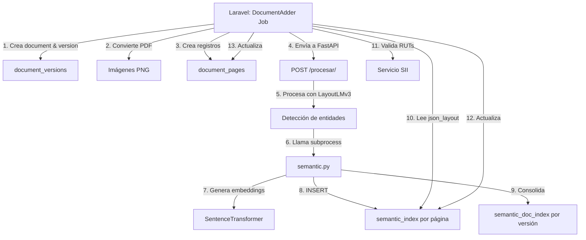

# ValiDocuIA - Sistema de Procesamiento de Documentos con IA

Este servicio proporciona capacidades de procesamiento de documentos mediante Inteligencia Artificial, incluyendo OCR, detección de entidades y búsqueda semántica.

## 📋 Tabla de Contenidos

- [Descripción General](#descripción-general)
- [Cambios Recientes (Octubre 2025)](#cambios-recientes-octubre-2025)
- [Arquitectura](#arquitectura)
- [Instalación y Configuración](#instalación-y-configuración)
- [Uso](#uso)
- [API Endpoints](#api-endpoints)
- [Estructura del Proyecto](#estructura-del-proyecto)
- [Solución de Problemas](#solución-de-problemas)

---

## 🎯 Descripción General

ValiDocuIA es un microservicio basado en FastAPI que procesa documentos PDF mediante:

1. **Conversión PDF → Imágenes**: Extrae páginas individuales en formato PNG
2. **OCR + Detección de Entidades**: Usa LayoutLMv3 para detectar campos estructurados
3. **Indexación Semántica**: Genera embeddings con SentenceTransformers y los almacena en PostgreSQL con pgvector
4. **Validación de Datos**: Valida RUTs contra el servicio del SII

---

## 🆕 Cambios Recientes (Octubre 2025)

### Sistema de Versionamiento de Documentos

Se implementó un sistema completo de versionamiento para documentos, permitiendo mantener un historial completo de cambios.

#### 1. Actualización del Esquema de Base de Datos

**Nuevas tablas:**
- `document_versions`: Almacena versiones individuales de cada documento
- `document_pages`: Páginas individuales de cada versión

**Cambios en tablas existentes:**
- `documents`: Ya no almacena `filename`, `filepath`, `due_date`, `normative_gap` (movidos a `document_versions`)
- `semantic_index`: Ahora indexa por **página** (`document_page_id`) en lugar de documento completo
- `semantic_doc_index`: Indexa por **versión** (`document_version_id`) en lugar de documento
- `document_analyses`: Analiza **versiones** específicas (`document_version_id`)

#### 2. Cambios en la API de FastAPI

**Endpoint `/procesar/` actualizado:**

**Antes:**
```python
POST /procesar/
{
  "master_id": "123",      # ID del documento
  "doc_id": "456",         # ID opcional
  "group_id": "789",
  "page": 1
}
```

**Después:**
```python
POST /procesar/
{
  "master_id": "123",      # ID del documento maestro
  "version_id": "456",     # ID de la versión (document_versions.id)
  "page_id": "789",        # ID de la página (document_pages.id)
  "group_id": "999",
  "page": 1                # Número de página (1,2,3...)
}
```

**Formato de archivos generado:**
```
documento_{master_id}_{version_id}_{page_id}_{group_id}_p{page_number}.json
```

Ejemplo: `documento_123_456_789_999_p0001.json`

#### 3. Actualización de semantic.py

El script de indexación semántica fue completamente actualizado para trabajar con el nuevo esquema:

**Cambios principales:**
```python
# ANTES - Insertaba en semantic_index por documento
INSERT INTO semantic_index (
    document_id,           # ❌ Ya no existe
    document_group_id,
    json_layout,
    embedding
)

# DESPUÉS - Inserta por página
INSERT INTO semantic_index (
    document_version_id,   # ✅ Referencia a la versión
    document_page_id,      # ✅ Referencia a la página específica
    document_group_id,
    json_layout,
    embedding
)

# ANTES - Insertaba en semantic_doc_index por documento
INSERT INTO semantic_doc_index (
    document_id,           # ❌ Ya no existe
    document_group_id,
    json_global,
    embedding
)

# DESPUÉS - Inserta por versión
INSERT INTO semantic_doc_index (
    document_version_id,   # ✅ Referencia a la versión
    document_group_id,
    json_global,
    embedding
)
```

**Consolidación de páginas:**
El script ahora:
1. Procesa cada página individualmente → `semantic_index`
2. Consolida todas las páginas de una versión → `semantic_doc_index`
3. Agrupa por: `master_id` + `version_id` + `group_id`

#### 4. Integración con PostgreSQL

**Variables de entorno añadidas:**
```bash
PG_DB=validocu                      # Nombre de la base de datos
PG_USER=postgres                    # Usuario de PostgreSQL
PG_PASS=1234                        # Contraseña
PG_HOST=host.docker.internal        # Host (desde Docker)
PG_PORT=5433                        # Puerto
```

**Conexión desde Docker:**
- Se agregó `extra_hosts: host.docker.internal:host-gateway` para permitir acceso al PostgreSQL del host
- Se instaló `psycopg2-binary==2.9.10` en requirements.txt

#### 5. Flujo Completo Actualizado



#### 6. Compatibilidad con Versiones Anteriores

Para mantener compatibilidad, el modelo `Document` en Laravel ahora usa **accessors** que obtienen datos de la versión actual:

```php
// Accessor methods en Document.php
public function getFilenameAttribute() {
    return $this->currentVersion()->first()?->filename;
}

public function getDueDateAttribute() {
    return $this->currentVersion()->first()?->due_date;
}
```

Esto permite que el código existente siga funcionando mientras se migra gradualmente al nuevo sistema.

---

## 🏗️ Arquitectura

```
┌─────────────────┐
│   Laravel API   │
│  (Backend PHP)  │
└────────┬────────┘
         │
         │ HTTP POST /procesar/
         ↓
┌─────────────────┐
│  FastAPI (IA)   │
│   main.py       │
└────────┬────────┘
         │
    ┌────┴────┬──────────┐
    ↓         ↓          ↓
┌──────┐  ┌─────────┐  ┌──────────┐
│ OCR  │  │ Layout  │  │ Semantic │
│Tesser│  │  LMv3   │  │   Index  │
└──────┘  └─────────┘  └──────────┘
                            │
                            ↓
                     ┌────────────┐
                     │ PostgreSQL │
                     │  +pgvector │
                     └────────────┘
```

---

## 🚀 Instalación y Configuración

### 1. Pre-requisitos

- Docker y Docker Compose
- PostgreSQL 14+ con extensión pgvector
- Red Docker: `validocu_network`

### 2. Configuración Inicial

1. **Copiar archivo de variables de entorno:**
   ```bash
   cd ValiDocuIA
   cp .env.example .env
   ```

2. **Editar `.env` con tus credenciales:**
   ```bash
   # Configuración de PostgreSQL
   PG_DB=validocu
   PG_USER=tu_usuario
   PG_PASS=tu_contraseña
   PG_HOST=host.docker.internal
   PG_PORT=5433
   
   # Configuración del modelo
   MODEL_DIR=/app/modelo_multiclase
   OCR_LANG=spa
   ```

3. **Crear la red Docker (si no existe):**
   ```bash
   docker network create validocu_network
   ```

### 3. Construcción y Ejecución

**Opción 1: Modo desarrollo (con hot-reload)**
```bash
docker-compose up -d
```

**Opción 2: Modo rápido (optimizado)**
```bash
docker-compose -f docker-compose.fast.yml up -d
```

### 4. Verificar que está corriendo

```bash
# Ver logs
docker-compose logs -f ia-api

# Verificar el endpoint
curl http://localhost:5050
```

---

## 📖 Uso

### Procesamiento de un Documento

**Request:**
```bash
curl -X POST http://localhost:5050/procesar/ \
  -F "file=@documento.png" \
  -F "master_id=123" \
  -F "version_id=456" \
  -F "page_id=789" \
  -F "group_id=999" \
  -F "page=1"
```

**Response:**
```json
{
  "mensaje": "✅ Página procesada",
  "master_id": "123",
  "version_id": "456",
  "page_id": "789",
  "group_id": "999",
  "page": 1,
  "json": "outputs/documento_123_456_789_999_p0001.json",
  "imagen_procesada": "outputs/resultado_123_456_789_999_p0001.png",
  "semantic_status": "ok"
}
```

### Conversión PDF a Imágenes

**Request:**
```bash
curl -X POST http://localhost:5050/pdf_to_images/ \
  -F "file=@documento.pdf"
```

**Response:**
```json
{
  "images": [
    {
      "filename": "documento_p1.png",
      "content_base64": "iVBORw0KGgoAAAANS..."
    },
    {
      "filename": "documento_p2.png",
      "content_base64": "iVBORw0KGgoAAAANS..."
    }
  ]
}
```

### Generación de Vector Semántico

**Request:**
```bash
curl -X POST http://localhost:5050/vector/ \
  -H "Content-Type: application/json" \
  -d '{"texto": "Este es un texto de ejemplo"}'
```

**Response:**
```json
{
  "embedding": [0.123, -0.456, 0.789, ...]
}
```

---

## 🔌 API Endpoints

| Endpoint | Método | Descripción | Parámetros |
|----------|--------|-------------|------------|
| `/procesar/` | POST | Procesa imagen con LayoutLMv3 | `file`, `master_id`, `version_id`, `page_id`, `group_id`, `page` |
| `/pdf_to_images/` | POST | Convierte PDF a imágenes PNG | `file` |
| `/vector/` | POST | Genera embedding de texto | `texto` |

---

## 📁 Estructura del Proyecto

```
ValiDocuIA/
├── app/
│   ├── main.py              # FastAPI endpoints
│   ├── prediccion.py        # LayoutLMv3 inference
│   ├── semantic.py          # Indexación semántica + PostgreSQL
│   ├── generar_vector.py    # Generación de embeddings
│   └── pdf_to_images.py     # Conversión PDF → PNG
├── outputs/
│   ├── modelo_multiclase/   # Modelo LayoutLMv3 entrenado
│   └── *.json               # Resultados de procesamiento
├── docker-compose.yml       # Configuración Docker (desarrollo)
├── docker-compose.fast.yml  # Configuración Docker (producción)
├── Dockerfile               # Imagen base
├── Dockerfile.fast          # Imagen optimizada
├── requirements.txt         # Dependencias Python
├── .env.example             # Plantilla de variables de entorno
└── README.md               # Este archivo
```

---

## 🔧 Solución de Problemas

### El contenedor no se conecta a PostgreSQL

**Error:**
```
psycopg2.OperationalError: could not connect to server
```

**Solución:**
1. Verificar que PostgreSQL está corriendo en el host:
   ```bash
   psql -U postgres -d validocu -p 5433
   ```

2. Verificar las variables de entorno en `.env`

3. Verificar que `host.docker.internal` está configurado:
   ```bash
   docker exec ia-api ping host.docker.internal
   ```

### semantic.py falla con error de columnas

**Error:**
```
column "document_id" does not exist
```

**Solución:**
Este error indica que las migraciones de Laravel no se ejecutaron correctamente. Verificar:

```bash
cd backend
php artisan migrate:status
```

Todas las migraciones `2025_10_14_*` deben estar en estado "Ran".

### El modelo no se carga

**Error:**
```
FileNotFoundError: Carpeta de modelo inválida
```

**Solución:**
1. Verificar que el modelo está en `outputs/modelo_multiclase/`
2. Verificar el volumen en docker-compose:
   ```yaml
   volumes:
     - ./outputs/modelo_multiclase:/app/modelo_multiclase
   ```

### Logs del contenedor

Ver logs en tiempo real:
```bash
docker-compose logs -f ia-api
```

Ver solo errores:
```bash
docker-compose logs ia-api | grep ERROR
```

---

## 🔄 Actualización del Contenedor

Cuando se hacen cambios en el código:

```bash
# 1. Detener el contenedor
docker-compose down

# 2. Reconstruir la imagen (sin caché para cambios importantes)
docker-compose build --no-cache

# 3. Iniciar el contenedor
docker-compose up -d

# 4. Verificar logs
docker-compose logs -f ia-api
```

---

## 📊 Monitoreo

### Verificar estado del contenedor
```bash
docker-compose ps
```

### Ver uso de recursos
```bash
docker stats ia-api
```

### Inspeccionar variables de entorno
```bash
docker exec ia-api env | grep PG_
```

### Probar conexión a BD desde el contenedor
```bash
docker exec ia-api python3 -c "import psycopg2; conn = psycopg2.connect(dbname='validocu', user='postgres', password='1234', host='host.docker.internal', port='5433'); print('✅ Conexión exitosa'); conn.close()"
```

---

## 📝 Notas de Desarrollo

- **Puerto:** El servicio corre en `http://localhost:5050`
- **Hot Reload:** Cambios en `app/*.py` se recargan automáticamente en modo desarrollo
- **Modelo:** LayoutLMv3 fine-tuned para detección de campos en contratos chilenos
- **Embeddings:** Modelo `all-MiniLM-L6-v2` de SentenceTransformers (384 dimensiones)
- **OCR:** Tesseract con configuración para español (`--oem 1 --psm 6`)

---

## 🤝 Contribución

Al realizar cambios:

1. **Nunca commitear `.env`** (está en `.gitignore`)
2. Actualizar `.env.example` con nuevas variables
3. Documentar cambios en este README
4. Probar con `docker-compose build --no-cache` antes de hacer push

---

## 📜 Licencia

[Incluir información de licencia aquí]

---

## 👥 Autores

[Incluir información de autores aquí]
